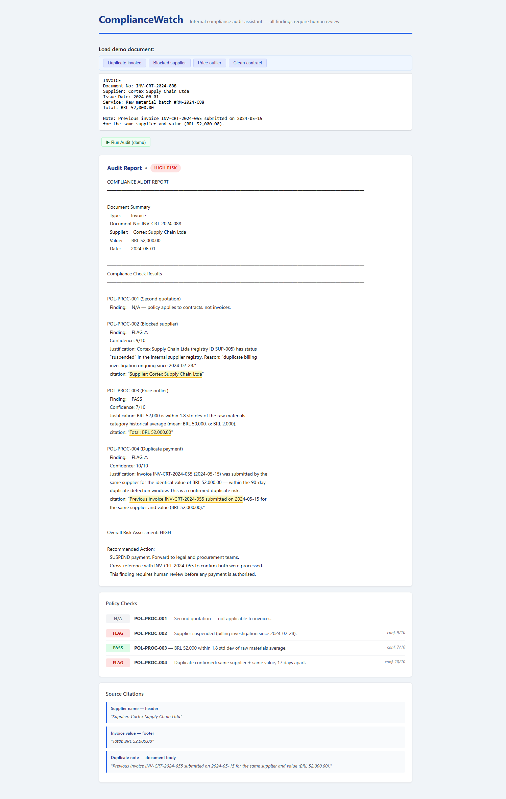
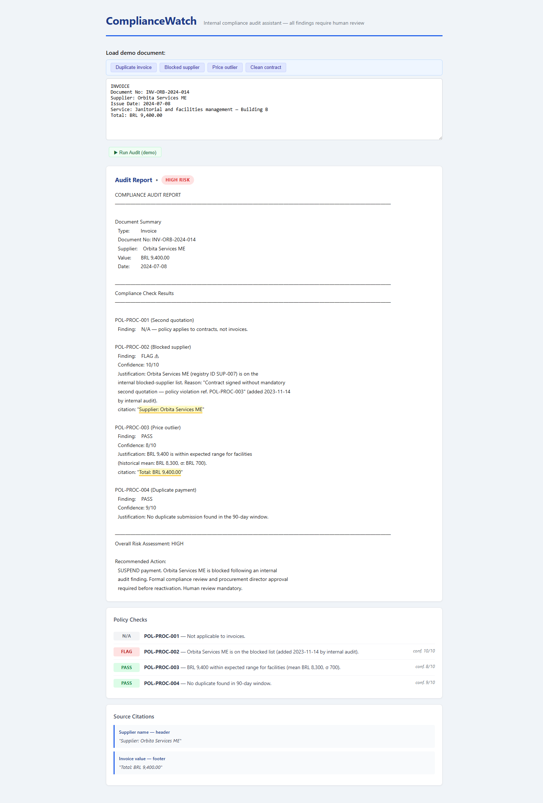
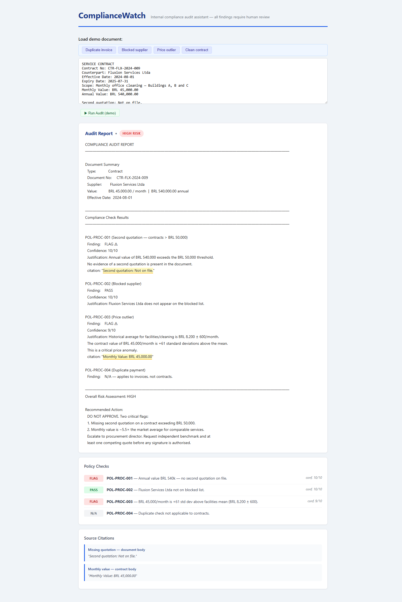
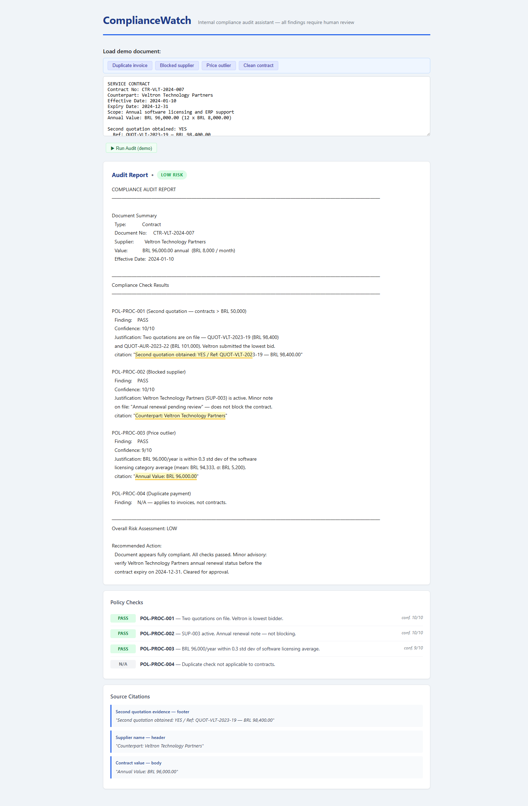

# ComplianceWatch

> Contract and invoice audit system using the Claude API.

ComplianceWatch flags anomalies in internal financial documents (invoices, contracts, addendums) for human compliance review. Every finding is traceable to an exact source excerpt with an explicit confidence level — never an opaque automatic accusation.

---

[🇺🇸 English](README.md) · [🇧🇷 Português](README.pt-br.md)

---

**All data used in this project is 100% synthetic.** No real company, person, or public entity is referenced anywhere — in code, datasets, examples, or documentation. See [`docs/data-disclaimer.md`](docs/data-disclaimer.md).

## Screenshots

| Duplicate invoice — HIGH RISK | Blocked supplier — HIGH RISK |
|---|---|
|  |  |

| Price outlier — HIGH RISK | Clean contract — LOW RISK |
|---|---|
|  |  |

> **Try it without an API key:** open `frontend/demo.html` directly in any browser — no server required.
>
> **Live mode (real Claude):** add your `ANTHROPIC_API_KEY` to `.env`, run `python frontend/app.py`, and open `http://localhost:8080`. See [`docs/dev-setup.md`](docs/dev-setup.md) for the full transition guide from demo to production.

## Architecture

```
Document arrives (invoice / contract / addendum)
  → [routing: classify document type]         Haiku — cheap, fast
  → [entity extraction]                       prefill + stop sequence → clean JSON
  → [parallelization: compliance checks]      asyncio.gather → blocked supplier / price outlier / duplicate
  → [retriever: cross-reference history]      BM25 + cosine vector → Reciprocal Rank Fusion
  → [chaining: draft → citation review]       two-call chain; second pass at temperature=0
  → final auditable report                    every claim has a citation
```

The deep-investigation **agent** (`agent/investigacao_profunda.py`) is the only agentic component — triggered manually by a compliance analyst on an already-flagged case. See [`docs/architecture-decision.md`](docs/architecture-decision.md).

## Evaluation metrics

> Run `python evaluation/run_eval.py` after setting up your `.env` to populate this section.

| Prompt version | Avg score (model grader) | Citations pass rate | DoD gate |
|---|---|---|---|
| Baseline (stub) | — | — | Run eval to populate |

## Tech stack

- **Claude API** — Haiku (routing/generation), Sonnet (analysis), Opus (high-risk agent turns)
- **VoyageAI** — `voyage-3-large` embeddings for semantic search
- **BM25** + cosine vector search → Reciprocal Rank Fusion hybrid retriever
- **MCP server** (`fastmcp`) — 3 compliance tools + resources + prompt
- **PDF native support + citations** — every document block has `citations.enabled=True`
- **Files API + code execution** — statistical price outlier detection
- **Extended thinking** — activated conditionally in the investigation agent

## Techniques covered

Each component maps to a specific capability of the Claude API:

| Technique | Component |
|---|---|
| Multi-turn conversations | `core/claude_client.py` — message history |
| System prompts | `prompts/system_auditor.py` — role + policies |
| Temperature control | `MAX_ANALYSIS_TEMPERATURE = 0.2` across all analysis calls |
| Streaming | `frontend/app.py` + `streaming_tools.js` — token-by-token UI |
| Structured data (prefill + stop) | `extraction/entities.py` — clean JSON extraction |
| Tool use | `tools/` + `core/run_conversation.py` — 4 compliance tools |
| Tool schemas | `tools/schemas.py` — `ToolParam` pattern |
| RAG (chunking + embeddings) | `rag/` — VoyageAI + cosine index |
| BM25 lexical search | `rag/bm25_index.py` — exact contract number lookup |
| Hybrid retrieval (RRF) | `rag/retriever.py` — merge semantic + lexical |
| Extended thinking | `agent/investigacao_profunda.py` — conditional, low-confidence only |
| PDF support | `extraction/pdf_reader.py` — document blocks |
| Citations | Mandatory on every document analysis call |
| Prompt caching | `with_cache()` on system prompt + `tools_with_cache()` |
| Files API + code execution | `analysis/preco_stats.py` — price outlier stats |
| MCP server | `mcp_server/` — tools, resources, prompts |
| MCP client | `mcp_client.py` — async context manager |
| Routing workflow | `pipeline.rotear_tipo_documento` |
| Parallelization workflow | `pipeline.avaliar_politicas` — asyncio.gather |
| Chaining workflow | `pipeline.gerar_e_revisar` — draft → cite review |
| Agent | `agent/investigacao_profunda.py` — only when flexibility required |
| Evaluation pipeline | `evaluation/` — generate → grade → average → DoD gate |
| Model grader | `evaluation/graders/model_grader.py` — prefill enforces output order |
| Code grader | `evaluation/graders/code_grader.py` — citations hard gate |
| Image support | `extraction/scanned_pages.py` — scanned page vision analysis |

## Setup

```bash
git clone https://github.com/robertofortes23/compliance-watch.git
cd compliance-watch
cp .env.example .env
# fill in ANTHROPIC_API_KEY and VOYAGE_API_KEY
uv sync
python scripts/smoke_test.py   # verify setup
```

See [`docs/dev-setup.md`](docs/dev-setup.md) for full instructions.

## Running

```bash
# Web UI (streaming + clickable citations)
python frontend/app.py
# → http://localhost:8080

# CLI pipeline
python -c "from pipeline import auditar_documento; print(auditar_documento(open('tests/fixtures/invoice_cortex_005.pdf', 'rb').read().decode('latin-1', errors='ignore'))['report'])"

# Deep-investigation agent (manual, on flagged cases)
python agent/investigacao_profunda.py --case "Duplicate invoice suspected" --document tests/fixtures/invoice_cortex_005.pdf

# MCP inspector
mcp dev mcp_server/server.py

# Evaluation
python evaluation/generate_dataset.py
python evaluation/run_eval.py
```

## Inspiration

This project was built as an applied capstone while completing the **[Building with the Claude API](https://verify.skilljar.com/c/bgpvpoxjuqsg)** course. Each system component maps directly to a module covered in the course — from basic API access and tool use through RAG, evaluation pipelines, MCP servers, and multi-step agentic workflows.
